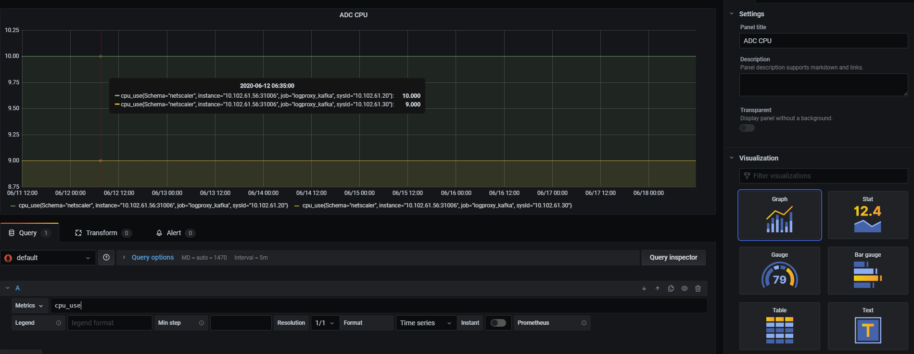

# Citrix ADC Observability Exporter with Prometheus and Grafana

You can configure Prometheus as an endpoint to pull data from Citrix ADC Observability Exporter. You can also configure Grafana to visualize the same data graphically.

Citrix ADC Observability Exporter has a push-gateway server that listens to port 5563 to serve metrics based on pull requests from Prometheus. Citrix ADC Observability Exporter exports time series data to Prometheus. 

## Deploy Citrix ADC Observability Exporter

You can deploy Citrix ADC Observability Exporter using the YAML file. Based on your Citrix ADC deployment, deploy Citrix ADC Observability Exporter either outside or inside Kubernetes clusters. You can deploy Citrix ADC Observability Exporter as a pod inside the Kubernetes cluster or on Citrix ADC MPX or VPX appliance outside the cluster.

**Prerequisites**

  -  Ensure that you have a Kubernetes cluster with kube-dns or CoreDNS addon enabled.

### Deploy a sample application

The following is an example procedure for deploying a sample webserver application.

**Note**: If you have a pre-deployed web application, skip the steps from step 1 to step 3.

  1.  Create a secret [ingress.crt](https://github.com/citrix/citrix-observability-exporter/blob/master/examples/ingress.crt) and key [ingress.key](https://github.com/citrix/citrix-observability-exporter/blob/master/examples/ingress.key) using your own certificate and key.
  
      In this example, a secret, called *ing* in the default namespace, is created.

          kubectl create secret tls ing --cert=ingress.crt --key=ingress.key

  2.  Access the YAML file from [webserver-es.yaml](https://raw.githubusercontent.com/citrix/citrix-observability-exporter/master/examples/elasticsearch/webserver-es.yaml) to deploy the application.

          kubectl create -f webserver-es.yaml

  3.  Define the specific parameters that you must import by specifying it in the ingress annotations of the application's YAML file, using the smart annotations in the ingress.

          ingress.citrix.com/analyticsprofile: '{"webinsight": {"httpurl":"ENABLED", "httpuseragent":"ENABLED", "httpHost":"ENABLED","httpMethod":"ENABLED","httpContentType":"ENABLED"}}'

      **Note**: The parameters are predefined in the `webserver-es.yaml` file.

      For more information about Annotations, see [Ingress annotations help](https://github.com/citrix/citrix-k8s-ingress-controller/blob/666d6267e5b09683740528c5e8dd46f16d7d16e0/docs/configure/annotations.md).

### Deploy Citrix ADC CPX with the Citrix ADC Observability Exporter support

You can deploy Citrix ADC CPX as a side car with the Citrix ADC Observability Exporter support enabled along with Citrix ingress controller. You can modify the Citrix ADC CPX YAML file `cpx-ingress-es.yaml` to include the configuration information that is required for the Citrix ADC Observability Exporter support.

  Perform the following steps to deploy a Citrix ADC CPX instance with the Citrix ADC Observability Exporter support:

  1.  Download the [cpx-ingress-prometheus.yaml](https://github.com/citrix/citrix-observability-exporter/blob/master/examples/prometheus/cpx-ingress-prometheus.yaml) and [cic-configmap.yaml](https://raw.githubusercontent.com/citrix/citrix-observability-exporter/master/examples/elasticsearch/cic-configmap.yaml) file.
  2.  Modify Citrix ADC CPX related parameters, as required.
  3.  Edit the `cic-configmap.yaml` file and specify the following variables for Citrix ADC Observability Exporter in the `NS_ANALYTICS_CONFIG` endpoint configuration.

          server: 'coe-prometheus.default.svc.cluster.local' # COE service FQDN
  
  **Note**: If you have used a namespace other than *default*, change `coe-prometheus.default.svc.cluster.local to` to `coe-prometheus.<desired-namespace>.svc.cluster.local`.

### Deploy Prometheus and Grafana using YAML files

To deploy Prometheus and Grafana using YAML files, perform the following steps:

 1.  Download the `Prometheus-Grafana` YAML file from [prometheus-grafana.yaml](https://raw.githubusercontent.com/citrix/citrix-observability-exporter/master/examples/prometheus/prometheus-grafana.yaml).
 2.  Edit the namespace definition if you want to use a different namespace other than *default*.
 3.  Run the following commands to deploy Prometheus and Grafana:

          kubectl create -f prometheus-grafana.yaml

   **Note**: Prometheus and Grafana are deployed in the default namespace of the same Kubernetes cluster.
   
### Deploy Citrix ADC Observability Exporter using the YAML file

  You can deploy Citrix ADC Observability Exporter using the YAML file. Download the YAML file from [coe-prometheus.yaml](https://raw.githubusercontent.com/citrix/citrix-observability-exporter/master/examples/prometheus/coe-prometheus.yaml).

  To deploy Citrix ADC Observability Exporter using the Kubernetes YAML, run the following command:
    
      kubectl create -f coe-prometheus.yaml

 **Note**: Modify the YAML file for Citrix ADC Observability Exporter if you have a custom namespace.
  
### Configure Citrix ADC to export metrics (optional)

  **Note**: If you do not use CIC to configure, then you can do the following manual configuration on your Citrix ADC.

  You can manually configure Citrix ADCs to export metrics to the Citrix ADC Observability exporter. Specify the Citrix ADC Observability Exporter IP/FQDN address as an HTTP service and combine it to the default `ns_analytics_time_series_profile` analytics profile. Enable the metrics export and set the output mode to Prometheus.
  
  The following is a sample configuration:

    add server COE_instance 192.168.1.102
    add service coe_metric_collector_svc_192.168.1.102 COE_instance HTTP 5563
    set analytics profile ns_analytics_time_series_profile -collector coe_metric_collector_svc_192.168.1.102 -Metrics ENABLED -OutputMode Prometheus

### Configure Prometheus (optional) to pull telemetry data

  Prometheus services are available as Docker images on [Quay container registry](https://quay.io/) and Docker Hub.

  To launch Prometheus and expose it on port 9090, run the following command:
  
    docker run -p 9090:9090 prom/prometheus
  
  To manually add Citrix ADC Observability Exporter as scrape target, edit the `prometheus.yaml` file. Specify the Citrix ADC Observability Exporter IP/FQDN address and the port 5563 as the scrape target in the YAML file.

    scrape_configs:
      - job_name: coe
        static_configs:
          - targets: ['192.168.1.102:5563']

### Configure Grafana

In the current deployment, a Prometheus server has already been added as a data source. If you use an existing Prometheus server for the deployment, ensure to add the same as a data source on your Grafana. For more information, see [Grafana support for Prometheus](https://prometheus.io/docs/visualization/grafana/).

### Create Grafana visualization

  You can create a Grafana dashboard and select the key metrics and the visualization type that is suitable for the data.

  The following procedure shows adding of the ADC CPU metric to a Grafana panel:

  1.  Specify the Panel Title as *ADC CPU*.
  2.  In the Query tab, for the query A, specify the metric as *cpu_use*.
  3.  In the Settings tab, select the **Visualization type**.

  You can modify the data and its representation in Grafana. For more information, see [Grafana Documentation](https://grafana.com/docs/grafana/latest/panels/panels-overview/).

  

  **Import pre-built dashboards for Grafana**

You can also import pre-built dashboards to Grafana. See the available [Dashboards](https://github.com/citrix/citrix-observability-exporter/tree/master/dashboards).

For information on troubleshooting related to Citrix ADC Observability Exporter, see [Citrix ADC CPX troubleshooting](https://docs.citrix.com/en-us/citrix-adc-cpx/current-release/cpx-troubleshooting.html).